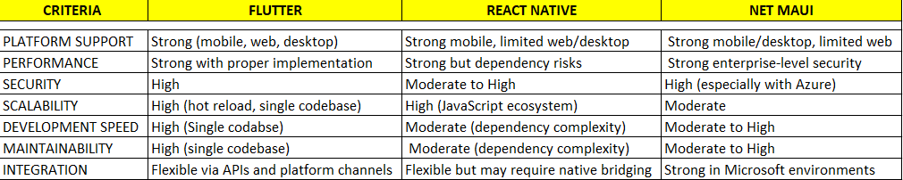

                            Framework Comparison

Selected Frameworks

This analysis will focus on the following cross-platform frameworks:

- Flutter
- React Native
- .NET MAUI

Comparison Criteria

The frameworks will be evaluated based on:

- Platform support
- Performance
- Security
- Scalability
- Development speed
- Maintainability
- Integration with proprietary systems

Initial Comparison Table

Notes

Further detailed analysis will be added in the next stage.
